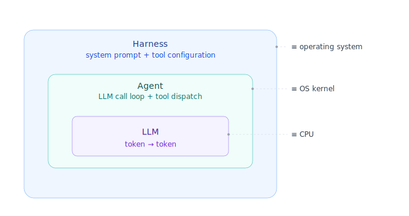

Some days back, the creator of Python put up a tweet checking whether his understanding of agents was correct. Andrej Karpathy put up a reply under that tweet, comparing traditional engineering concepts to the agentic ecosystem.

![[../images/comparison-tweet.png]]

The original tweet from Guido van Rossum can be found [here](https://x.com/gvanrossum/status/2039045160156426463?s=46&t=SpGulJ9nlM3Fv26dxWW1dw) and Karpathy's reply is [here](https://x.com/karpathy/status/2039054981719089202?s=46&t=SpGulJ9nlM3Fv26dxWW1dw).

This reply made me curious as to where the _Harness_ would sit in this entire stack. Harness has been a buzzword for quite some time now and different people have different definitions for it. A simple Google search returns some blogs, but I don't think there are a lot of write-ups or any universally accepted definition for it right now. Some of the blogs I liked and resonated with are linked at the end of this post.

According to me, the third component in the above comparison should be the Operating System itself, and it equates to the *Harness*, which makes the updated list look something like this:

| Agentic    | ≡   | Traditional computing                                                                         |
| ---------- | --- | --------------------------------------------------------------------------------------------- |
| **LLM**    | ≡   | CPU — *tokens not bytes; statistical and vague, not deterministic and precise* |
| **Agent**  | ≡   | Operating system kernel                                                                       |
| **Harness**| ≡   | Operating system                                                                              |

Equating the CPU and LLM makes sense — those are the actual *brains* or processors of the information. That is where information goes to be processed and a result is returned. An *Agent* in my opinion is simply an LLM call wrapped in an infinite loop with the capability to act on different directives we call *tools*. Now if we are comparing the primitives, the tool calls become your CPU's instruction set.

Now, similar to how an operating system kernel like Linux wraps this instruction set and implements the logic for OS booting, orchestrating instructions to enable common operations like connecting to a network, using I/O devices, and manipulating storage via system calls — the agent, with its system prompt and tool configuration, exposes different sets of functionality. This is what we may call a *Harness*.

Obviously it's not exactly a 1:1 mapping and there are grey areas where the above explanation also falls short or becomes ambiguous, but this is my mental model at the moment.

## Reading/References

A list of some other opinions and writing I liked and found interesting.

1. [OpenAI - Harness Engineering](https://openai.com/index/harness-engineering/)
2. [Anthropic - Harness design for long running agents](https://www.anthropic.com/engineering/harness-design-long-running-apps)
3. [Anthropic - Effective harnesses for long-running agents](https://www.anthropic.com/engineering/effective-harnesses-for-long-running-agents)