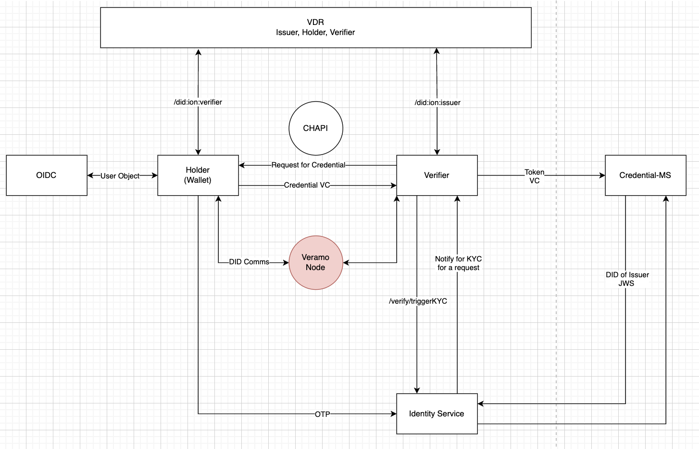

## Introduction

**Registry, Credentials and Wallet (RCW)** is a project that implements the core [Verifiable Credentials](https://www.w3.org/TR/vc-data-model/) (VC) Specification published by W3C.

Initial implemenetation of RCW was done as the core credentialling services for the [Unified Learner's Passbook (ULP)](https://github.com/unified-Learner-Passbook/) project which was proposed in the [National Education Policy, 2020 (NEP 2020)](https://www.education.gov.in/sites/upload_files/mhrd/files/NEP_Final_English_0.pdf) by Ministry of Education, Government of India. The pilot launch of ULP is scheduled for the state of **Uttar Pradesh, India** (most populous state of India). 

## Open Source Relevance

The core services, namely, [Credential-MS](https://github.com/unified-Learner-Passbook/credential-ms), [Cred-Schema-MS](https://github.com/Unified-Learner-Passbook/Cred-schema-ms) and [Identity](https://github.com/Unified-Learner-Passbook/identity) were abstracted out and contributed to [Sunbird RC](https://docs.sunbirdrc.dev/learn/readme). Sunbird RC is the software which powers the generation and management of credentials like our **COVID Vaccination certificate** in India. These core services are maintained by the original implementers, [SamagraX](https://github.com/Samagra-Development) alongside me here at [Registry, Credentials and Wallet (RCW)](https://github.com/SamagraX-RCW).

[Link to commits contributed by me to Sunbird RC for their 2.0 release](https://github.com/Sunbird-RC/sunbird-rc-core/commits/release-2.0.0/?author=techsavvyash)

## Architecture, Tech Stack and Deployment

These services follow a **microservices architecture** to enable credentialling in your project. The architecture of how these services work with each other is shown in the picture below.

Each of these services are built using `NestJS` with `TypeScript` and come bundled with `Dockerfile`, `Jenkinsfile` and `Ansible` roles for easy deployment. The [RCW Github Organisation](https://github.com/SamagraX-RCW) has the [devops](https://github.com/SamagraX-RCW/devops) which hosts a one click deployment mechanism of these services to be used in any project.

## References

- [Verifiable Credentials Specification](https://www.w3.org/TR/vc-data-model/)
- [National Education Policy 2020](https://www.education.gov.in/sites/upload_files/mhrd/files/NEP_Final_English_0.pdf)
- [Unified Learner's Passbook Github](https://github.com/unified-Learner-Passbook/)
- [Sunbird RC](https://docs.sunbirdrc.dev/learn/readme)
- [Team SamagraX on Github](https://github.com/Samagra-Development)
- [RCW Github](https://github.com/SamagraX-RCW)