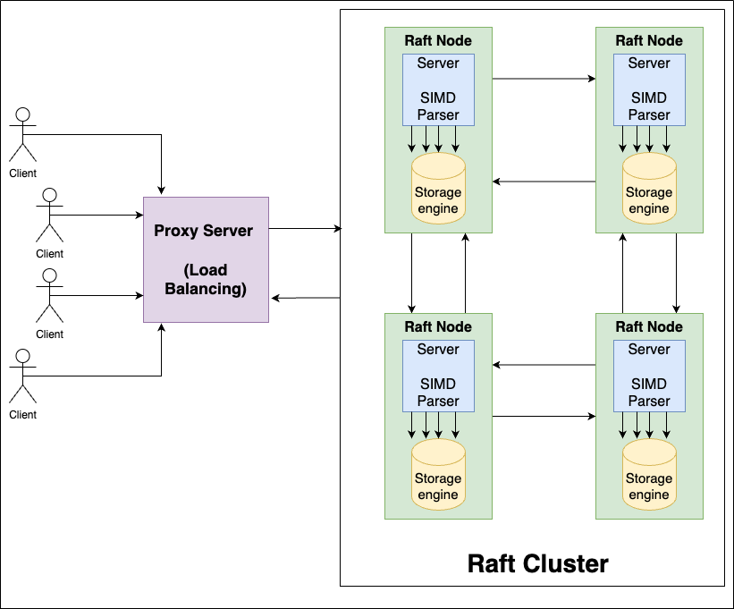

StylusDB is a collection (presently 2 but there will be more) of toy databases built by me and [Chakshu Gautam](https://github.com/ChakshuGautam) while trying to tinker around and learn the database internals.

There is [Stylus-SQL](https://github.com/ChakshuGautam/stylusdb-sql) which is an implementation of a small SQL DB with it's own SQL parsing engine and storage layer and everything. This was created in a tutorial like fashion so that people (mostly college students) can start taking up building their own database without being very overwhelmed and we started with a very crude regex and csv file based implementation so make it as approachable as possible but suggestions and improvements are always welcome.
We also took a couple of live sessions for the first 21 steps recordings for which can be accessed as this [Youtube Playlist](https://youtube.com/playlist?list=PL8CVpW1i0uq7BeT_dR-oGHJsgO5hkcwf4&si=V-H_hJZGEeuU7Wls).

We also have [StylusDB JS](https://github.com/ChakshuGautam/stylusdb-js) (there is no fancy name for this one yet) which is a redis like distributed key value store that I built as a part of my B.Tech. final year project. This was aimed at me trying to learn more about distributed systems in a practical way after taking a theory course on distributed computing in my 7th semester and as a result of this I researched into and read about distributed consensus algorithms like Paxos, RAFT, ZAP, etc. and finally ended up using RAFT to implement the distributed databases trying to opitmise and modify the algorithm to make it a bit faster and I ended up implementing things like direct reads from followers rather than only the leader to serve the requests and reduce response times with the trade off being that the data might be stale due to eventual consistency. We also used SIMD for faster TCP stream data processing trying to shave off some time and we did see around 1.5-2x perf boost over the native JSON.parse().

The architecture for the project looked something like shown below.

StylusDB was started along side a small community called [Status 20X](https://www.status20x.in/) which I aim to create as a place for deep tech nerds who can think beyond passing tech interviews and actually enjoy the computer science.